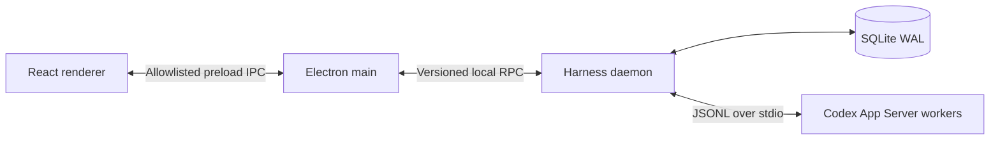

# Architecture overview

Codex Harness is a local-first desktop task control system. Codex App Server remains the agent execution boundary; Harness adds durable tasks, persistent plans, intelligent routing, scheduling, approvals, evidence, and recovery.



## Process ownership

- Renderer is untrusted presentation code. It receives no Node integration or raw IPC primitive.
- Electron main owns one Harness daemon child for V1. Closing the desktop stops background execution; a later launch recovers durable state.
- Harness daemon exclusively owns application persistence and Codex App Server worker processes.
- App Server stdout is protocol traffic. stderr is diagnostics. They are never mixed.
- V1 uses bidirectional supervision for a single-supervisor failure: a surviving Electron main terminates the daemon's tracked process groups, while a surviving daemon observes Electron-main liveness and terminates its tracked descendants. Simultaneous supervisor loss, an operating-system crash, and descendants that deliberately escape their owned group are not hard-containment guarantees on Unix; recovery must mark affected runs interrupted rather than completed.

## Product objects

```text
Project
└── Task
    ├── Requirement revisions
    ├── Persistent Plan
    ├── Task nodes and dependencies
    ├── Runs and Codex thread mappings
    ├── Route decisions
    ├── Approvals
    └── Evidence
```

Harness owns task and dependency state. A high-tier model may propose a plan or DAG, but it cannot directly advance authoritative node state.

## Routing boundary

Logical tiers are `fast`, `standard`, and `deep`. Users configure the actual provider, model, and reasoning effort for each tier. Harness combines deterministic safety floors, structured classification, and runtime escalation. Risky code such as security, migration, concurrency, public API, or production changes is not treated as routine merely because the user asked to “write code.”

## Plan and compaction boundary

Structured Codex plan events are captured as revisioned proposals. Harness persists stable step IDs, pending work, constraints, decisions, and evidence. Text-only lists can become candidate plans but are not authoritative without normalization and confirmation.

An external Harness cannot transparently inject state into model reasoning already in progress after same-turn context compaction. V1 rehydrates at the next safe turn boundary and marks post-compaction output for revalidation.

## Delivery order

Runtime capabilities remain off until their dependencies are present:

1. workspace and protocol contracts;
2. Codex App Server adapter;
3. daemon lifecycle and transport;
4. SQLite event journal and recovery primitives;
5. task and persistent-plan state;
6. compaction rehydration;
7. model profiles and shadow routing;
8. serial scheduling;
9. secure desktop shell and task UI;
10. approval, evidence, runtime recovery, and packaging gates.
