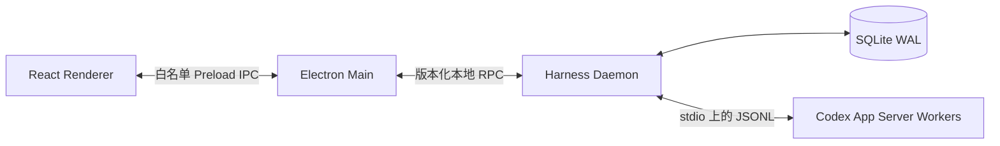

# Codex Harness 总体设计

状态：已批准，按独立 PR 增量交付

跟踪入口：[GitHub Issue #2](https://github.com/Muqian-Sun/codex-harness/issues/2)

本文档是 Codex Harness 长期总体设计的仓库内规范版本。PR 专属实现设计记录在对应 PR 正文，不作为独立设计文件进入仓库。

## 1. 背景与问题

Codex 能执行代码、工具和推理任务，但一次对话中的待办列表、依赖关系、完成标准和重要决定主要依赖上下文。长任务发生上下文压缩后，未持久化的计划可能退化或丢失；模型也可能把“声称完成”误当作“已经验证完成”。

Codex Harness 在 Codex App Server 外增加一个本地控制层。Codex 继续负责推理和执行，Harness 负责维护权威任务状态、持久计划、依赖图、模型路由、调度、审批、证据和恢复，并通过桌面端向用户展示这些状态。

## 2. 目标

- 提供类似 Codex 和 Claude 的 Electron 桌面任务界面。
- 把用户需求规范化为可持久化、可恢复、可验证的任务和计划。
- 由 Harness 构建并维护任务节点及 DAG 的权威状态。
- 根据复杂度、系统性、风险和运行反馈选择用户配置的模型档位。
- 在上下文压缩后恢复目标、未完成步骤、约束、决定和证据。
- 对工具调用、写操作和外部副作用实施独立于模型档位的权限控制。
- 使用可审计证据确认完成状态，支持中断、崩溃和重启后的保守恢复。

## 3. 非目标与约束

- V1 不提供桌面关闭后继续执行的常驻后台 daemon。
- V1 不支持连接到任意已存在 daemon；Electron main 每次只拥有一个子 daemon。
- V1 不保证操作系统或断电故障、两个监督者同时消失，或恶意后代进程逃逸受控 Unix 进程组后的强隔离。
- V1 先采用串行调度；并行调度必须作为后续独立能力设计。
- 模型不能直接提交权威任务状态，也不能自行提高权限。
- 未实现审批、证据和恢复门禁前，不启用对应高风险运行时能力。

## 4. 高层架构



### 4.1 进程职责

- Renderer 是不可信展示层，不启用 Node integration，也不获得原始 IPC、shell、文件系统、SQLite、凭据或 Codex 进程访问能力。
- Electron main 负责安全窗口、白名单 preload API、本地 RPC 客户端和一个 Harness daemon 子进程，但不持有业务状态。
- Harness daemon 是应用状态、SQLite 写入、调度、路由以及 Codex App Server worker 的唯一所有者。
- Codex App Server 保持 agent 执行边界；Harness 不复制其推理职责。
- App Server stdout 只承载协议消息，stderr 只承载诊断，二者不得混合。

### 4.2 信任边界

所有跨进程输入、数据库反序列化结果、App Server 消息和 renderer 请求在运行时验证前均不可信。TypeScript 类型不能代替边界验证。Renderer 到 main、main 到 daemon、daemon 到 App Server 使用彼此独立的协议和最小权限接口。

## 5. 进程生命周期与监督

Electron main 启动一个 Harness daemon。macOS/Linux 使用仅所有者可访问的 Unix domain socket，Windows 使用 named pipe。main 生成 256 位 CSPRNG 启动 capability，通过继承 FD 3 单次交给 daemon；该值不进入 argv、普通环境变量、日志、持久化或 renderer。继承 FD 4 只用于父进程存活检测。

V1 使用现有两个监督角色处理单一监督者故障：

- Electron main 意外退出而 daemon 仍存活时，daemon 从 FD 4 读取 EOF，原子进入 `QUIESCING`，关闭全部 spawn gate，再请求优雅中断和排空，终止已跟踪后代并退出。
- daemon 意外退出而 main 仍存活时，main 使用工作启用前记录的 kill-domain 标识终止 daemon 进程组及单独跟踪的 worker 或 PTY 组。
- Windows 在启用工作前把进程树加入不可 breakaway、带 `JOB_OBJECT_LIMIT_KILL_ON_JOB_CLOSE` 的 Job Object。
- 超过优雅关闭时限后，监督者按 graceful termination、`SIGTERM`、`SIGKILL` 的顺序升级。

同时失去两个监督者、操作系统崩溃、断电或故意逃逸进程组不属于 Unix 硬保证。重启后相关运行只能标记为 `interrupted` 或 `containment_unknown` 并等待核对，不能推断为完成，也不能自动恢复写操作。

## 6. 领域模型

```text
Project
└── Task
    ├── Requirement Revisions
    ├── Persistent Plan Revisions
    ├── Task Nodes and Dependencies
    ├── Runs and Codex Thread Mappings
    ├── Route Decisions
    ├── Approvals
    └── Evidence
```

- `Project` 表示工作目录、仓库和项目级策略的集合。
- `Task` 表示用户目标及其当前权威状态。
- `Requirement Revision` 保存需求原文、规范化约束和验收条件的版本历史。
- `Plan Revision` 保存候选或已确认计划；计划步骤拥有稳定 ID。
- `Task Node` 是可调度、可验证的最小工作单元。
- `Dependency` 表示节点间的先决条件，并形成必须无环的 DAG。
- `Run` 表示一次具体执行尝试，关联 Codex thread/turn、路由、权限和结果。
- `Approval` 记录用户或策略对外部副作用的授权。
- `Evidence` 记录测试、构建、差异、人工确认或其他完成证明。

## 7. 任务节点与 DAG

Harness 而不是模型拥有节点和 DAG 的权威状态。高级模型可以提出拆分、顺序和依赖，但输出只能形成候选修订。Harness 必须验证节点 ID、依赖存在性、无环性、状态前置条件和权限约束后，才可原子提交。

节点至少区分 `pending`、`ready`、`running`、`blocked`、`succeeded`、`failed`、`interrupted` 和 `cancelled`。只有所有必要依赖满足且审批门禁通过的节点可以进入 `ready`。模型报告成功只结束执行尝试，节点必须在证据策略通过后才能进入 `succeeded`。

DAG 由 Harness 的计划规范化器和调度器共同产生：规范化器把需求与候选计划转换为稳定节点；调度器根据依赖和状态计算可运行集合。V1 串行领取一个 `ready` 节点，避免并发写冲突；后续并行能力必须引入资源锁、冲突域和确定性恢复设计。

## 8. 持久计划与上下文压缩恢复

结构化 Codex plan 事件保存为带版本的候选计划。Harness 持久化稳定步骤 ID、目标、未完成工作、约束、决定、依赖、验收条件和证据引用。文本中的待办列表可以被识别为候选计划，但在规范化和确认前不是权威状态。

每个安全轮次边界，Harness 为 Codex 构造最小恢复上下文，包括当前目标、活动需求修订、未完成节点、关键约束、已确认决定和所需证据。注入内容来自持久状态，而不是依赖旧对话的自然语言摘要。

外部 Harness 无法在模型同一轮发生上下文压缩后透明修改其正在进行的推理。V1 只保证在下一个安全轮次边界重新注入状态，并把压缩后、重新注入前产生的输出标记为需要重新验证。

## 9. 智能模型路由

Harness 只使用逻辑档位：

- `fast`：简单、低风险、边界清晰的任务。
- `standard`：一般代码编写、测试、局部重构和常规分析。
- `deep`：高层决策、复杂任务、系统性问题、高不确定性或高风险变更。

用户为每个档位配置实际 provider、model 和 reasoning effort。分类规则只输出逻辑档位，不能把具体模型名称硬编码到任务分类逻辑；每次 `RouteDecision` 还必须保存解析后的 provider、model、reasoning effort 和配置版本快照，以便审计与回放。

路由按以下顺序决策：

1. 确定性安全下限根据安全、迁移、并发、公共 API、生产影响、权限和不可逆性设置最低档位。
2. 结构化分类器根据复杂度、影响范围、系统性、歧义、工具需求和预计步骤数给出候选档位及理由。
3. 策略引擎应用用户预算、可用模型、速率限制和项目规则。
4. 运行时根据失败、反复修正、验证不通过或风险升级向更高档位迁移。
5. 每次决策记录输入特征、策略版本、配置版本、选择结果和解释，支持影子评估与回放。

模型档位和权限级别是独立决策。选择 `deep` 不会自动获得 shell、文件写入、网络或外部系统写权限；选择 `fast` 也不能绕过任务本身的安全下限。

## 10. 持久化设计

V1 使用 SQLite WAL，而不是把 Markdown 文件作为权威状态存储：

- 任务、节点、依赖、运行、审批和证据需要跨表事务与一致性约束。
- 崩溃恢复需要原子提交、WAL 和可重复查询。
- 调度器需要高效查询 `ready` 节点、活动运行和过期租约。
- Schema 版本和迁移比自由格式 Markdown 更适合机器状态演进。

Markdown 可作为面向用户的导出、快照或审阅格式，但不是调度和恢复的权威来源。Harness daemon 是 SQLite 的唯一写入者；其他进程只能通过版本化 RPC 访问状态。数据库不得保存明文凭据，provider 密钥进入操作系统钥匙串。

持久层采用事件日志与当前投影结合的方式：状态变更先以带序号事件持久化，再在同一事务中更新查询投影。恢复时校验事件连续性和投影版本；无法证明一致的运行进入保守中断状态。

## 11. Codex App Server 边界

Harness daemon 通过 stdio 上的 JSONL 拥有 Codex App Server worker。每条消息独占一行，stdout 只解析协议；stderr 单独采集并脱敏。连接必须先完成 `initialize`，再发送 `initialized`，之后才允许 thread、turn、模型查询、审批和事件处理。

适配器负责：

- 固定并记录兼容的 Codex CLI/App Server 版本与 Schema 摘要；
- 对请求、响应、通知和 server-initiated request 做穷尽分类；
- 关联请求 ID、thread、turn、任务节点和运行；
- 将审批请求转为 Harness 的权限流程；
- 对未知实验性方法默认关闭并安全诊断；
- 在断连、超时、重复或迟到消息下保持确定性失败语义。

App Server 的 `thread/compact/start` 只触发 Codex 侧压缩；Harness 的持久计划与轮次边界恢复是独立机制。V1 不向 renderer 暴露 `thread/shellCommand` 等可绕过 Harness 权限边界的原始能力。

## 12. Desktop 到 Harness 协议

main 与 daemon 使用换行分隔 JSON。每个连接的第一帧必须是严格的 `system.hello` bootstrap request；认证成功前，daemon 拒绝其他帧并关闭连接。认证先于 capability 和应用协议协商。

握手后连接固定到精确匹配的应用协议版本。V1 wire version 为 `1`，应用协议版本为 `1.0`。应用层使用 `request`、`response`、`error` 和 `event` 四类 envelope；V1 只允许 main 发起 RPC。

关键约束：

- 启动 capability 是 256 位 CSPRNG 的规范、无填充 43 字符 base64url 编码，并使用常量时间比较。
- `streamId` 是 128 位 CSPRNG 的规范、无填充 22 字符 base64url 编码。
- 事件序号从 `1` 严格递增；重复事件可忽略，缺口触发重新同步，不同 `streamId` 必须从持久状态重建。
- 帧上限为 1 MiB UTF-8 字节，不含 LF 和可选 CR；解码必须使用 fatal UTF-8，并在未终止缓冲区超限前关闭连接。
- 请求 ID 在单连接的 in-flight 集合中唯一；断连请求不得自动重放，后续写 API 使用独立幂等键。
- 请求及请求参数使用严格 Schema；非内部响应和事件可接受同协议内新增的可选字段。
- `JsonValue` 验证限制最大深度 64、访问节点和待处理工作各 100,000，并拒绝循环、访问器、类实例、非有限数和其他非 JSON 值。
- `internal.error` 使用固定安全消息，只允许非敏感 correlation ID，禁止序列化堆栈、环境变量、请求参数、原始帧或凭据。

初始应用方法为 `system.health` 和 `system.shutdown`。`system.shutdown` 只请求经过认证的优雅排空，不向 renderer 提供直接终止进程能力。

## 13. Desktop 安全边界

- `contextIsolation` 开启，`nodeIntegration` 关闭，renderer sandbox 开启。
- Preload 只暴露白名单、窄类型 API，不暴露原始 `ipcRenderer`。
- main 对每个 IPC 请求再次验证来源、参数和当前窗口/任务权限。
- Renderer 资源使用严格 CSP；不加载任意远程代码。
- 文件选择、shell、剪贴板、通知和外部链接等系统能力由 main 单独审批。
- Provider 凭据保存在操作系统钥匙串，只在 daemon 需要时通过受控通道使用，不返回 renderer。

## 14. 审批、权限与证据

权限策略按操作风险而不是模型能力决定。只读操作、工作区写入、命令执行、网络、凭据访问和外部系统写入使用不同权限级别。审批记录包含请求摘要、作用域、过期时间、决策者和关联运行。

节点完成策略可以要求单元测试、类型检查、构建、差异核对、文件存在性、外部检查或人工确认。模型返回的自然语言结论只是候选结果；Harness 收集并验证证据后才提交节点完成。

## 15. 日志、隐私与诊断

Renderer、Electron main、Harness daemon 和每个 App Server worker 的日志彼此分离，也与协议流分离。日志使用结构化事件和 correlation ID，不记录启动 capability、provider 密钥、完整未信任帧、环境变量或未经策略允许的用户内容。

路由和调度记录保留可解释输入与结果，但避免把完整提示词作为默认遥测。V1 默认本地运行；任何外部遥测必须单独设计并由用户明确开启。

## 16. 交付顺序

运行时能力在依赖具备前保持关闭：

1. 工作区、协议契约与 CI：已由 PR #1 完成。
2. Codex App Server 适配器。
3. daemon 生命周期与本地传输。
4. SQLite 事件日志和恢复原语。
5. 任务与持久计划状态。
6. 上下文压缩恢复。
7. 模型配置和影子路由。
8. 串行调度。
9. 安全 Electron 桌面壳与任务 UI。
10. 审批、证据、运行恢复和打包门禁。
11. 端到端验证、故障注入、安全检查和发布。

每个 PR 只交付一个可独立验证的能力。依赖 PR 必须等待前置 PR 合并。若实现发现需要改变已批准范围、架构、依赖、关键技术选型、安全模型或跨 PR 契约，必须停止实现并更新 Proposal。

## 17. 全局验证标准

每个 PR 至少运行：

```text
pnpm format:check
pnpm lint
pnpm typecheck
pnpm test
pnpm build
pnpm smoke:build
```

每个 PR 还必须完成与风险相称的安全、兼容性、集成和故障验证，并针对同一个 head SHA 连续完成两轮无新增可执行问题的审查。合并使用 squash，校验预期 head SHA；合并完成后确认目标提交，再删除远程和本地功能分支。
