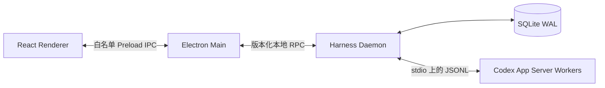

# Codex Harness 总体设计

状态：已批准，按独立 PR 增量交付

跟踪入口：[GitHub Issue #2](https://github.com/Muqian-Sun/codex-harness/issues/2)

桌面信息架构变更：[GitHub Issue #54](https://github.com/Muqian-Sun/codex-harness/issues/54)

本文档是 Codex Harness 长期总体设计的仓库内规范版本。PR 专属实现设计记录在对应 PR 正文，不作为独立设计文件进入仓库。

## 1. 背景与问题

Codex 能执行代码、工具和推理任务，但一次对话中的待办列表、依赖关系、完成标准和重要决定主要依赖上下文。长任务发生上下文压缩后，未持久化的计划可能退化或丢失；模型也可能把“声称完成”误当作“已经验证完成”。

Codex Harness 在 Codex App Server 外增加一个本地控制层。Codex 继续负责推理和执行，Harness 负责维护权威任务状态、持久计划、依赖图、模型路由、调度、审批、证据和恢复，并通过桌面端向用户展示这些状态。

## 2. 目标

- 提供类似 Codex 和 Claude 的 Electron 桌面任务界面。
- 把用户需求规范化为可持久化、可恢复、可验证的任务和计划。
- 由 Harness 构建并维护任务节点及 DAG 的权威状态。
- 根据复杂度、系统性、风险和运行反馈选择用户配置的模型档位。
- 在上下文压缩后恢复目标、未完成步骤、约束、决定和证据。
- 对工具调用、写操作和外部副作用实施独立于模型档位的权限控制。
- 使用可审计证据确认完成状态，支持中断、崩溃和重启后的保守恢复。

## 3. 非目标与约束

- V1 不提供桌面关闭后继续执行的常驻后台 daemon。
- V1 不支持连接到任意已存在 daemon；Electron main 每次只拥有一个子 daemon。
- V1 平台交付顺序为 macOS、Windows、Linux。macOS 是首发、打包和端到端验收平台；Windows named pipe 和 Job Object 在第二阶段交付；Linux 的 POSIX 差异、CI 和发布验证排在 Windows 之后。每个平台完成独立实现与证据门禁前，不得宣称该平台生产可用。
- 必需 CI 跟随当前交付平台：macOS 阶段使用固定 macOS runner；Windows 和 Linux 的必需 job 在对应平台能力开始交付时分别加入，不用尚未支持的平台结果阻塞当前平台 PR。
- V1 不保证操作系统或断电故障、两个监督者同时消失，或恶意后代进程逃逸受控 Unix 进程组后的强隔离。
- V1 先采用串行调度；并行调度必须作为后续独立能力设计。
- 模型不能直接提交权威任务状态，也不能自行提高权限。
- 未实现审批、证据和恢复门禁前，不启用对应高风险运行时能力。

## 4. 高层架构



### 4.1 进程职责

- Renderer 是不可信展示层，不启用 Node integration，也不获得原始 IPC、shell、文件系统、SQLite、凭据或 Codex 进程访问能力。
- Electron main 负责安全窗口、白名单 preload API、本地 RPC 客户端和一个 Harness daemon 子进程，但不持有业务状态。
- Harness daemon 是应用状态、SQLite 写入、调度、路由以及 Codex App Server worker 的唯一所有者。
- Codex App Server 保持 agent 执行边界；Harness 不复制其推理职责。
- App Server stdout 只承载协议消息，stderr 只承载诊断，二者不得混合。

### 4.2 信任边界

所有跨进程输入、数据库反序列化结果、App Server 消息和 renderer 请求在运行时验证前均不可信。TypeScript 类型不能代替边界验证。Renderer 到 main、main 到 daemon、daemon 到 App Server 使用彼此独立的协议和最小权限接口。

## 5. 进程生命周期与监督

Electron main 启动一个 Harness daemon。macOS/Linux 使用仅所有者可访问的 Unix domain socket，Windows 使用 named pipe。main 生成 256 位 CSPRNG 启动 capability，通过继承 FD 3 单次交给 daemon；该值不进入 argv、普通环境变量、日志、持久化或 renderer。继承 FD 4 只用于父进程存活检测。

V1 使用现有两个监督角色处理单一监督者故障：

- Electron main 意外退出而 daemon 仍存活时，daemon 从 FD 4 读取 EOF，原子进入 `QUIESCING`，关闭全部 spawn gate，再请求优雅中断和排空，终止已跟踪后代并退出。
- daemon 意外退出而 main 仍存活时，main 使用工作启用前记录的 kill-domain 标识终止 daemon 进程组及单独跟踪的 worker 或 PTY 组。
- Windows 在启用工作前把进程树加入不可 breakaway、带 `JOB_OBJECT_LIMIT_KILL_ON_JOB_CLOSE` 的 Job Object。
- 超过优雅关闭时限后，监督者按 graceful termination、`SIGTERM`、`SIGKILL` 的顺序升级。

同时失去两个监督者、操作系统崩溃、断电或故意逃逸进程组不属于 Unix 硬保证。重启后相关运行只能标记为 `interrupted` 或 `containment_unknown` 并等待核对，不能推断为完成，也不能自动恢复写操作。

macOS 首发的 daemon 运行时只接受位于当前用户私有目录中的绝对 Unix socket 路径，拒绝复用已存在端点，监听后将 socket 权限固定为 `0600`。启动 capability 必须从 FD 3 有界读取且在启动前完成规范校验；FD 4 的 EOF、错误或异常关闭触发一次保守排空。运行时按 `starting`、`listening`、`quiescing`、`closed` 转换，停止监听后先冲刷已排队响应，再在超时后销毁连接；库层不得直接退出进程。Electron main 的 spawn、独立进程组和升级终止策略在该 daemon 运行时之上实现。

macOS 的 Electron main 监督层在当前用户私有 runtime root 下创建随机 `0700` 目录，以独立 POSIX 进程组启动 daemon，固定 FD 3/FD 4 管道布局，并在 RPC hello 前验证 socket 所有者、`0600` 权限及 dev/inode。main 另外维护不随单次启动清理的私有 state root，并只把固定的 `harness.db` 绝对路径交给 supervisor。监督层必须显式接收并在 spawn 前验证一个绝对、可执行的 Codex CLI 路径及 state database 的私有父目录；调用方参数不能覆盖 supervisor 拥有的 endpoint、Codex executable 或 state database，实际 argv 只追加固定 `--endpoint`、`--codex-executable` 与 `--state-database` 值，startup capability 仍只经 FD 3 传递。daemon 只有在精确 Codex 版本、App Server 初始化、完整模型目录、去敏 account snapshot、SQLite schema 校验和全部当前领域投影恢复均成功后才监听，因此 supervisor 默认 readiness deadline 为 45 秒，以覆盖版本检查、App Server 初始化、单页模型目录和 account snapshot 两次默认有界请求的 40 秒窗口；调用方仍可在 60 秒上限内显式设置。多页目录仍受 45 秒外层总 deadline 限制，不允许单页请求上限无限累加。正常停止先请求 RPC 排空并关闭 watchdog 写端；daemon 在连接、endpoint 与 worker 收敛后关闭 state store，SQLite 关闭失败报告稳定 `state_shutdown_failed`。宽限期后监督层只对启动时记录的负 PGID 依次发送 `SIGTERM`、`SIGKILL`。daemon leader 意外退出不等价于进程域已清空，监督层仍检查同组后代；无法证明进程组消失时结果必须是 `containment_unknown`。endpoint 只在身份未变化时删除，随机目录只在为空且身份未变化时删除；稳定 state root 与数据库不属于 runtime 清理范围。监督层不自动发现或下载 Codex、不自动重启或重放请求，也不把底层 stderr、环境、路径或启动 capability 暴露给上层。

## 6. 领域模型

```text
Project
└── Task
    ├── Requirement Revisions
    ├── Persistent Plan Revisions
    ├── Task Nodes and Dependencies
    ├── Runs and Codex Thread Mappings
    ├── Route Decisions
    ├── Approvals
    └── Evidence
```

- `Project` 表示工作目录、仓库和项目级策略的集合。
- `Task` 表示用户目标及其当前权威状态。
- `Requirement Revision` 保存需求原文、规范化约束和验收条件的版本历史。
- `Plan Revision` 保存候选或已确认计划；计划步骤拥有稳定 ID。
- `Task Node` 是可调度、可验证的最小工作单元。
- `Dependency` 表示节点间的先决条件，并形成必须无环的 DAG。
- `Run` 表示一次具体执行尝试，关联 Codex thread/turn、路由、权限和结果。
- `Approval` 记录用户或策略对外部副作用的授权。
- `Evidence` 记录测试、构建、差异、人工确认或其他完成证明。

## 7. 任务节点与 DAG

Harness 而不是模型拥有节点和 DAG 的权威状态。高级模型可以提出拆分、顺序和依赖，但输出只能形成候选修订。Harness 必须验证节点 ID、依赖存在性、无环性、状态前置条件和权限约束后，才可原子提交。

节点至少区分 `pending`、`ready`、`running`、`blocked`、`succeeded`、`failed`、`interrupted` 和 `cancelled`。只有所有必要依赖满足且审批门禁通过的节点可以进入 `ready`。模型报告成功只结束执行尝试，节点必须在证据策略通过后才能进入 `succeeded`。

DAG 由 Harness 的计划规范化与 materialization 路径产生；调度器只消费已提交的权威 DAG，并根据依赖和状态计算可运行集合。V1 串行领取一个 `ready` 节点，避免并发写冲突；后续并行能力必须引入资源锁、冲突域和确定性恢复设计。首个产品增量只做只读串行预检：按权威拓扑序区分依赖已满足的首个 `pending` 节点、等待领取的单个 `ready` 节点、正在运行的单个 `running` 节点、终止阻塞集合和全部成功；多个 `ready`/`running`、二者并存或依赖未成功却已进入活动状态时保守失败。`dependency_eligible` 不是 `ready`，不表示审批、路由、权限或证据门禁已经通过。

节点/DAG 领域内核把已确认计划规范化为版本化 Graph Revision，并作为 `task.graph_committed` 事件与 Task 当前投影原子提交。每个节点保存稳定 UUID、来源计划步骤、描述、验收条件和前驱节点 UUID；Harness 要求所有已确认计划步骤被覆盖，拒绝重复、缺失引用、自依赖和环，并按节点输入顺序为并列根生成确定性拓扑序。Graph 提交时节点只能由 Harness 初始化为 `pending`，模型不能在 Graph 输入中声明 `ready`、`running` 或 `succeeded`。需求修订或新的 confirmed plan 会立即清除 active graph；仅 candidate plan 不会替换当前权威 DAG。Graph 历史保留在事件日志，当前投影只保存 active graph 和单调修订计数。当前产品已把纯本地 materialization 和只读串行预检接入 daemon 与桌面：用户对 confirmed Plan 发起独立操作后，Harness 为每个 Plan step 确定性生成一个节点，并按步骤顺序建立保守串行依赖；详情读取再从当前 Graph 状态派生预检结果，经 Electron main 把内部节点 UUID 转换为 `T01…`。这些操作不调用模型、不修改节点状态、不创建 Run，也不授予执行权限。节点状态流转、审批/证据门禁和实际领取仍未接入产品运行路径。

## 8. 持久计划与上下文压缩恢复

结构化 Codex plan 事件保存为带版本的候选计划。Harness 持久化稳定步骤 ID、目标、未完成工作、约束、决定、依赖、验收条件和证据引用。文本中的待办列表可以被识别为候选计划，但在规范化和确认前不是权威状态。

任务与计划领域内核使用独立 `task.plan` 事件流保存 Task 创建、Requirement Revision 和 Plan Revision。Task 使用单调版本做事务内乐观并发校验；每个修订 UUID 同时作为对应事件 UUID，利用事件日志的全局唯一约束阻止修订 ID 被复用。Requirement Revision 保存用户原文、规范化目标、约束和验收条件，Plan Revision 区分 `candidate` 与 `confirmed` 并为每个步骤分配稳定 UUID；单项和单次修订的文本容量均受限，避免合法字段组合放大为无界投影。当前投影保留 active requirement、latest plan 和 last confirmed plan，完整修订历史留在不可变事件日志。需求修订会清除基于旧需求的 latest candidate，但保留 last confirmed plan 作为历史参照；新计划必须显式绑定当前 requirement revision。候选计划仍不能直接调度，必须由后续节点/DAG 规范化与确认门禁转换。

用户在任务中途补充或纠正需求时，Harness 先保存新的 Requirement Revision，并使旧 active graph 保守失效；不得继续领取旧节点，也不得把旧 TODO 静默改写为新需求。后续需求变更协调器负责比较旧需求、用户增量、当前计划和执行证据，保留语义未变节点的稳定 ID，为新增工作创建节点，把删除或改变验收条件的工作形成可审阅差异，并在重新验证后提交新的 Plan/Graph Revision。正在运行和已经成功的节点不能因文本修订自动继承有效性；具体中断、重新验证和确认策略作为独立能力交付。

需求变更调和内核以当前 Task version、Requirement、confirmed Plan 和 active Graph 的前驱 ID 作为乐观并发条件，在一个事件批次内提交新的 Requirement、confirmed Plan 与 Graph。Harness 从旧权威状态和新提案确定性派生 `preserved`、`added`、`removed`、计划相对顺序变化、节点依赖变化和需要重新验证的节点；调用方不能直接声明差异结果。复用步骤 ID 时标题、描述和验收条件必须逐项相同，复用节点 ID 时来源步骤与工作语义也必须逐项相同；语义变化必须表现为删除旧 ID 并创建新 ID。依赖边可以调整但必须进入差异记录，所有新图节点一律重新 materialize 为 `pending`，运行中的旧节点则拒绝切换并等待后续安全轮次边界处理。Task 当前投影保存与 active graph 对齐的 reconciliation 摘要，候选计划不清除它，Requirement、新 confirmed Plan 或独立 Graph 变更会清除它。三事件完整重试保持幂等，部分存在或任一校验失败整体回滚。该内核不判断自然语言语义、不直接接入 daemon，也不替代后续模型提案、审批、执行证据和安全中断能力。

每个安全轮次边界，Harness 为 Codex 构造最小恢复上下文，包括当前目标、活动需求修订、未完成节点、关键约束、已确认决定和所需证据。注入内容来自持久状态，而不是依赖旧对话的自然语言摘要。

恢复上下文内核从经过领域校验的 Task 当前投影确定性构造版本化胶囊。胶囊使用固定前缀和按键排序的规范 JSON，包含 Task/version、活动 Requirement、当前权威 confirmed Plan、尚不可执行的 candidate Plan、DAG 拓扑、未完成节点的完整工作语义、终态节点的最小摘要以及最近一次需求调和差异。它明确区分仅有需求、候选计划待确认、已确认计划待建图、活动 DAG 和活动 DAG 上存在新候选计划五种阶段；新 candidate Plan 不会抹掉仍绑定当前 Requirement 的 confirmed Plan，后者继续作为权威计划随胶囊恢复，前者只作为待确认提案。基于旧 Requirement 的 confirmed Plan 只作为历史修订 ID 暴露，不得成为当前执行依据。恢复文本不含时间戳，SHA-256 摘要和 Task/Requirement/Plan/Graph/Reconciliation 修订 ID 共同组成 freshness fence；发送前必须从最新投影重建并逐项比较，任何状态或内容变化都使旧胶囊失效。

V1 恢复胶囊只生成符合固定 App Server Schema 的单个 `turn/start` text input，并同时限制为最多 1,000,000 个 JavaScript 字符和 1 MiB UTF-8 字节；超限或关系不一致时保守失败，不截断 TODO、验收条件或未完成节点。该领域内核本身不调用 App Server、不改变出站方法白名单，也不建立 Task/Run 与 Codex thread/turn 的映射；这些连接属于后续安全轮次协调器。

外部 Harness 无法在模型同一轮发生上下文压缩后透明修改其正在进行的推理。V1 只保证在下一个安全轮次边界重新注入状态，并把压缩后、重新注入前产生的输出标记为需要重新验证。

安全轮次恢复门禁使用固定 Task/thread/turn 绑定，确定性归并经过适配器校验的生命周期信号。重复信号幂等，乱序的 started/completed/turn-summary 压缩事实只累加、不回退；错绑定和冲突终止状态保守失败，单个 turn 最多保存 1,024 个不同压缩 item 的观察事实。活动 turn 始终禁止恢复，任一 `completed`、`interrupted` 或 `failed` 终止边界都要求下一 turn 重新注入权威胶囊，而不是只在已观察到压缩时恢复；观察到任一压缩事实时，当前 turn 结果还必须标记为需要重新验证。准备下一轮时重新比较最新 Task 与恢复胶囊 freshness，只有终止边界、Task 绑定和新鲜胶囊同时成立才产生冻结的准备结果。该结果不是可长期缓存的授权，实际发送方仍必须在同一串行临界区立即复核并构造 `turn/start`。门禁内核本身不建立 Run 映射、不调用 App Server，也不把 turn 终止解释为节点证据通过。

在固定的 App Server 协议中，`thread/compact/start` 只表示开始压缩并立即返回空结果，实际生命周期通过 `turn/*`、`item/*` 和 `contextCompaction` item 事件观察；`turn/steer` 只会追加到仍在执行的当前 turn，不能作为压缩后的同轮修复通道。因此协调器必须等待 `turn/completed` 等可证明的安全边界，再把 freshness fence 仍有效的胶囊加入下一次 `turn/start`；不得承诺在正在执行的 turn 内透明修复。

## 9. 智能模型路由

Harness 只使用逻辑档位：

- `fast`：简单、低风险、边界清晰的任务。
- `standard`：一般代码编写、测试、局部重构和常规分析。
- `deep`：高层决策、复杂任务、系统性问题、高不确定性或高风险变更。

用户为每个档位配置实际 provider、model 和 reasoning effort。分类规则只输出逻辑档位，不能把具体模型名称硬编码到任务分类逻辑；每次 `RouteDecision` 还必须保存解析后的 provider、model、reasoning effort 和配置版本快照，以便审计与回放。

模型配置领域内核把用户输入规范化为版本化的完整三档映射。每个配置修订包含 UUID、正整数修订序号以及 `fast`、`standard`、`deep` 三个必填目标；每个目标严格包含 provider、model 和 reasoning effort。Harness 允许用户把多个逻辑档位映射到同一实际目标，不根据名称猜测模型强弱。解析逻辑只接受逻辑档位，并返回包含配置修订和实际目标的冻结快照；它不选择权限、不查询模型目录，也不在配置无效或不可用时静默回退。当前纯内核只证明单个对象结构合法；跨修订序号单调性由后续持久化提交门禁保证，账户可用性、模型目录、预算、限流和执行前复核属于后续策略与运行时门禁。

模型路由配置以稳定 profile ID 形成独立事件流，当前投影保存 profile version、活动配置和创建/更新时间。首次配置必须从 version 0 提交 revision 1；后续配置同时校验期望 profile version、前一 revision ID、严格加一的新 revision number 和不回退的事件时间。配置 revision ID 同时作为 event ID，完整相同重试幂等，stale fence、跳号或冲突内容整体回滚。路由 profile repository 接受 daemon 统一拥有的事件库并要求对应投影已经注册，不自行打开或关闭 SQLite；它本身不决定 Project 绑定、模型目录或 RouteDecision。

桌面 V1 使用 daemon 内部固定且不对 renderer 暴露的默认 routing profile，提供严格的 `routing.configuration.get` 与 `routing.configuration.set`。首次读取返回显式未配置状态；写入必须一次提交完整的 `fast`、`standard`、`deep` 三档映射，并携带当前 profile version、前一 configuration revision 和 main 生成的 UUID command ID。daemon 在新写入前要求三个 provider 精确等于当前 worker 目录 provider、模型存在于当前完整目录且不是 hidden、reasoning effort 被该模型明确报告支持；任一条件不满足、目录不再 current 或 fence 过期都保守失败，不按模型名猜测能力、不选择近似模型，也不回退到其他档位。历史 command ID 的完整重试先读取原事件时间，再复用 repository 的内容幂等校验，因此不会因重试生成不同事件；同一 ID 的不同内容保持冲突。

已保存配置的读取会按当前目录重新计算每档 `observed_available`、`provider_unobserved`、`model_unavailable` 或 `reasoning_effort_unsupported`，但只向桌面公开 profile version、configuration revision、完整三档映射和这些状态，不公开固定 profile ID、事件时间、模型内部 ID、hidden、snapshot 或 worker session。配置从当前目录消失时仍可观察原持久映射及不可用原因，不能据此执行；配置本身不负责 Project binding、Task 分类、RouteDecision、权限或执行授权。

Project 通过独立的单调 binding version 引用一个活动路由 profile。首次绑定必须从 version 0 和空 previous profile 开始；改绑同时校验当前 binding version、前一 profile、目标 profile 的当前 version/config revision 以及不早于目标 profile 生效时间的事件时间，禁止对当前同一 profile 产生无意义的新绑定。绑定事件保存写入时观察到的 profile version 与 configuration revision 作为审计快照，但 profile 后续配置更新会自动成为该 Project 的当前配置，不要求重新绑定。历史 event ID 的完全一致重试先于当前 profile 和绑定检查，因此在 profile 更新或 Project 改绑后仍返回原历史结果；内容或 metadata 变化保持冲突。当前投影只保存每个 Project 的最新绑定，完整历史保留在事件日志。该 repository 复用统一 EventStore 并要求 profile 与 binding 投影均已注册；既有 binding 事件不因新增 Project registry 而改写，后续 coordinator 必须同时证明注册 Project、当前 Task 归属和活动 binding，不能只凭 binding 启动执行。

Project registry 以不可变注册事件建立 project version 1 的当前记录，并用独立 workspace owner 投影阻止完全相同的规范工作目录描述符被多个 Project 注册。工作目录明确保存 `macos`、`windows` 或 `linux` 平台与规范绝对路径，并固定标记为 identity 尚未验证；当前校验只有跨平台词法规范、长度和危险 Windows namespace 拒绝，绝不把字符串相同解释为 dev/inode、Windows file ID、符号链接、大小写或 Git 仓库 identity 相同。Project 修改、路径迁移和物理目录复核仍需后续独立能力。

桌面 Project 注册表通过严格的 `project.catalog_page` 与 `project.register` 接入该领域内核。Renderer 只能发起零参数的工作区选择请求；Electron main 校验受管 main frame 后打开原生单目录选择器，根据当前宿主平台和返回的规范绝对路径派生显示名，并生成 Project/command UUID。daemon 先按历史 command ID 完整校验未知结果重试；新 command 再按 workspace owner 查询，重复选择返回现有 Project，新工作区才写入事件。桌面只投影 Project ID/version、显示名、平台、用户所选绝对路径和固定 `unverified` 状态；事件时间、projection key、数据库元数据和底层错误不跨边界。目录选择、字符串注册和 UI 展示都不证明文件身份、读写权限、Git 状态或执行授权，也不自动建立 routing profile binding。

桌面通过独立的 `project.routing_binding.status_batch` 和 `project.routing_binding.bind_default` 显式建立 Project 到内部默认 profile 的关系。启动先取得权威 Project 首页面，再按相同顺序和数量读取最多 12 个绑定状态；main 只向 renderer 投影 Project ID、`unbound`、`default_bound`、`other_profile_bound` 三态和 binding version，不投影任意 profile ID、绑定时 configuration revision 或事件信息。写请求只能由受管 renderer 提交当前可见 Project ID，main 重新读取原始 binding 与当前默认 routing configuration，生成 command ID 并构造完整乐观并发 fence；daemon 再证明注册 Project、当前 binding 和目标 profile。历史 command 完整重试保持幂等，新 command 对精确相同默认绑定返回 `existing` 而不写事件，其他 stale 或内容冲突只返回固定错误。注册、配置和启动读取都不会隐式补写 binding；绑定不授权执行。

Task 到 Project 的权威归属使用独立单调 ownership version。首次归属从 version 0 和空 previous Project 开始；改绑必须严格匹配当前 ownership version、前一 Project、当前 Task version 与目标 Project version，并禁止同 Project 的无意义改绑和事件时间回退。事件保存写入时观察到的 Task/Project version，历史 event ID 精确重试先于当前状态检查，因此 Task 后续修订或再次改绑后仍能返回原结果。当前归属按 Task 投影，同时维护 `projectId/taskId` 反向索引；改绑在同一事件事务内删除旧索引并写入新索引。该事实只供后续 coordinator 解析 Project，不授予目录访问、模型执行或其他权限。

影子路由内核使用固定策略版本和结构化特征快照确定性计算候选档位。简单且低复杂度、低歧义、局部、短步骤、少工具的任务可选择 `fast`；一般代码变更和常规分析至少选择 `standard`；架构决策、系统性诊断、高复杂度、跨系统、高歧义、长步骤或广泛工具任务选择 `deep`。安全敏感、数据迁移、并发敏感、公共 API 变更、生产影响、不可逆操作或权限边界变更中的任一信号都会把安全下限提升到 `deep`；最终档位只能取候选档位与安全下限中的较高者。输出保存冻结的输入特征、稳定理由码、配置修订与实际模型快照，并固定为 `shadow` 且不可执行。该纯内核不证明特征来源；模型或用户提供的低风险声明不能直接成为权威安全事实，来源协调、模型目录和执行前复核完成前不得接入运行路径。

权威 route feature snapshot 从经过领域校验的 Task 当前投影和恢复 freshness fence 确定性构造，并支持绑定当前 DAG 中的可选节点。snapshot 保存 Task 阶段、需求项数、当前权威与候选计划步骤数、图节点/依赖数和节点依赖闭包，不复制完整需求文本；Task、Requirement、Plan、Graph、Reconciliation 任一修订或内容摘要变化都会使旧 snapshot 失效。Task 结构提供 complexity、scope、ambiguity 和 estimated steps 基线；在任务类型与工具计划没有权威来源时，策略分别至少使用 `analysis` 和 `multiple`，避免未经证明地进入 `fast`。用户或模型 candidate 统一标记为 advisory，只能按字段强度保持或提高基线，不能降低；source 标签仅用于审计，不赋予权限。

安全信号严格区分“candidate 报告存在风险”和“尚未证明不存在风险”。candidate `true` 可以保守设置风险下限，candidate `false` 仍记录为 unresolved。虽然四类独立 observer 与品牌组合 coordinator 已可产生完整 shadow evidence，但 feature snapshot 尚未接入经过真实运行时 gate、workspace/runtime registry freshness 和安全 turn boundary 复核的权限计划、工作区分析、运行目标及外部副作用证据，因此仍固定 `deep` routing floor、`shadow` 和不可执行。snapshot decoder 会重建有效特征、provenance、未解决列表和 SHA-256 摘要；实际使用方仍必须在安全串行边界针对最新 Task 重新构造并比较。该能力不修改现有 RouteDecision 事件，解除 deep floor 必须由后续运行时证据 gate 和 evidence-to-feature PR 逐项完成。

Harness route evidence 使用 daemon authority session 内的进程品牌约束任务类型、完整工具计划和安全观察覆盖。authority 创建时固定 task classifier、tool planner 和安全 observer 的完整 policy version 集合，签发时每份观察必须精确匹配，避免同一 session 内用陈旧或任意策略标签冒充当前证据。证据同时绑定当前 Task recovery fence、可选活动 DAG 节点和不早于 Task 更新时间的观察时间；序列化、克隆、其他 authority session/policy set 或进程重启后的对象只能严格解码用于审计，不能恢复权威身份。工具广度只从去重的完整工具类别集合派生；工具计划缺失时保持 unresolved。安全负面证明使用固定双来源覆盖矩阵，任一来源报告风险即为 present，只有每个信号规定的全部 Harness observer 都明确报告 absent 时才为 absent，缺少任一来源均为 unresolved。`completeForRouting` 只表示本证据契约要求的观察覆盖完整，snapshot 仍固定 `shadow`、不可执行，也不会解除现有 feature snapshot 的 `deep` 下限；具体 observer、coordinator 与运行时复核必须后续独立交付。

封闭操作清单路由 observer 是首个具体证据观察器。daemon 信任边界内的调用方提供一份穷尽且有界的操作枚举，observer 在创建时固定 task classifier、tool planner 和 `operation_plan` policy version，并从同一清单确定性派生任务类型、去重且完整的工具类别计划，以及 `operation_plan` 负责的并发、迁移、不可逆、权限边界、生产影响和公共 API 六项安全观察。观察结果绑定当前 Task recovery fence、可选活动 DAG 节点、观察时间和进程内 observer session；严格解码后的 JSON 只可审计，不能恢复 WeakSet 权威品牌。该清单的“封闭”目前只是 observer 输入契约，尚未由 App Server 工具 gate 证明实际调用没有越界，因此本观察器不接入 route evidence authority、feature snapshot 或执行路径，单一来源的 `absent` 也不能替代双来源负面证明，更不能解除现有 `deep` 下限。

权限计划路由 observer 接受显式标记 `complete: true`、有界且可为空的固定 capability 请求列表，不允许调用方直接填写安全布尔值。它在创建时固定 `permission_plan` policy version，并从凭据访问、特权命令、权限边界和生产访问确定 security-sensitive，从两类显式不可逆 capability 确定不可逆操作，同时把权限边界 capability 独立报告为边界变更；普通工作区、命令、网络或外部写请求仍由权限系统单独决定批准级别，不自动等同于安全敏感。观察结果同样绑定 Task recovery fence、可选活动 DAG 节点、观察时间和进程内 observer session，clone 或严格解码不能恢复 WeakSet 品牌。`complete: true` 目前只是调用契约，尚未由操作 manifest、App Server approval 或实际工具 gate 强制，因此该 observer 不授予权限、不接入 route evidence authority 或执行路径，单一 `permission_plan` 的 `absent` 不能替代双来源负面证明，也不能解除 `deep` 下限。

工作区分析路由 observer 接受显式标记 `complete: true`、绑定不透明 workspace snapshot ID 与小写 SHA-256 digest、最多 512 项的固定 finding 集合，不允许调用方直接提交安全布尔值，也不保存路径或代码内容。它从共享可变状态和并发资源访问 finding 确定并发敏感，从数据库 schema 和持久数据重写 finding 确定迁移，从导出 API 和协议契约 finding 确定公共 API 变化，并从认证授权、凭据处理、密码学和安全边界 finding 确定安全敏感；快照绑定 Task recovery fence、可选活动 DAG 节点、观察时间、策略和进程内 observer session，严格解码可重算完整投影但不能恢复 WeakSet 品牌。本模块不读取文件系统、不重算 digest，也不证明上游分析确实穷尽或该 workspace snapshot 仍是 Project 当前工作区，因此 `complete: true` 和 `isCurrent` 都不能单独解决 workspace TOCTOU；在真实分析器、工作区快照注册表和安全边界 coordinator 落地前，它只提供 shadow 证据，不接入 route evidence authority 或执行路径，单一来源的 `absent` 不能解除 `deep` 下限。

运行目标路由 observer 接受显式标记 `complete: true`、绑定不透明 runtime inventory snapshot ID 与小写 SHA-256 digest、最多 128 项的固定目标集合，不允许调用方直接提交生产影响布尔值，也不保存目标名、主机、账号、URL、区域或部署 payload。目标环境使用固定类别：本地、临时、开发、测试和预发布报告非生产，生产数据面、生产控制面和客户生产环境报告 `productionImpact: present`；类别表达真实影响边界而不是显示名称，未来注册表必须把共享生产控制面的目标保守分类为生产控制面。快照绑定 Task recovery fence、可选活动 DAG 节点、观察时间、策略和进程内 observer session，严格解码可重算报告与摘要但不能恢复 WeakSet 品牌。本模块不发现目标、不重算 inventory digest，也不证明目标计划确实穷尽或 inventory 仍是 Project 当前状态；在目标注册表、运行时目标 gate 和安全边界 coordinator 落地前，它只提供 shadow 证据，不接入 route evidence authority 或执行路径，单一 `runtime_target` 的 `absent` 不能替代与 `operation_plan` 的双来源负面证明，也不能解除 `deep` 下限。

安全路由证据组合 coordinator 内部创建并持有四个 observer 与一个不对外暴露的 route evidence authority，以同一 coordinator session 和完整策略集合建立品牌链。调用方只能提交由这些内部 observer 创建的四份当前观察；coordinator 要求它们同时绑定当前 Task、同一可选节点和同一 recovery fence，并把四个观察时间的最大值作为 evidence 时间。任务分类、完整工具计划和 operation report 只来自 operation observer，另外三份 report 只能来自各自 observer；最终双来源聚合和 `completeForRouting` 仍由既有 authority 唯一计算，避免第二套矩阵。其他 coordinator、clone 或严格解码对象即使 session ID 与策略字符串相同也无法通过 WeakSet 品牌。该组合只证明观察来源、Task/节点当前性和策略一致，不证明上游 manifest、权限计划、工作区分析或目标 inventory 的完整性与新鲜度；完整 evidence 仍是 shadow、不可执行，不接入 feature snapshot、RouteDecision 或运行路径，也不能解除 `deep` 下限。

影子 RouteDecision 由 Harness 从命令特征和当前 profile 配置重新计算，调用方不能提交最终档位、理由或模型目标。记录绑定 decision、Task/version、可选节点、profile、配置 revision fence 和发生时间，以 `taskId/decisionId` 作为只增审计投影键；决策 decoder 会重新运行固定策略并核对全部派生字段。写入前先按 decision ID 查询：已存在时只接受所有业务字段、特征、配置 fence 和 metadata 均相同的历史重试，即使 profile 后来更新也返回原决策；不存在时必须证明期望配置仍是 profile 当前 revision，且 decision 时间不早于该 revision 的生效时间，过期 fence 或不可能的时间线不得创建新决策。记录始终保持 `shadow` 与不可执行，不成为权限或调度授权。

模型目录事实来自同一 Codex App Server worker 认证会话的完整 `model/list(includeHidden=true)` 分页结果，不能来自 Harness 内置的静态模型名单。目录快照绑定 daemon 分配的 snapshot ID、worker session ID、provider 和观察时间，不保存账号或凭据；第一页、游标链、末页闭合、模型与 effort 唯一性都必须验证，旧目录缺失 `inputModalities` 时按 App Server 兼容规则视为 `text` 与 `image`。只有当前 daemon 进程内经过完整分页工厂创建的冻结实例具有验证资格，序列化、克隆或进程重启不继承该资格。用户三档目标只按精确 provider、model 和 reasoning effort 检查，结果区分已观测可用、provider 未观测、model 不可用和 effort 不支持，不猜测名称、不自动回退。快照只证明该认证边界在该时间点的目录事实，固定不可授权执行。

同一 worker manager 在进入 ready 前还必须执行一次固定 `account/read { refreshToken: false }`，并把响应立即投影为去敏 account snapshot。adapter 在结果离开协议边界前剥离 email 和所有未知字段；manager 只保存认证是否已满足、是否需要 OpenAI 认证、固定凭据类别、已知 ChatGPT plan type、snapshot ID、worker session ID 和观察时间。account 为 null 时区分 `authentication_required` 与 `not_required`，存在固定 account 时报告 `authenticated`；未知 account/plan、主动 refresh 参数、读取失败或 freshness 非法都失败关闭。`account/updated` 的参数不足以成为权威账户事实，因此 adapter 只把合法通知降为无 payload 的失效信号，worker manager 随后串行重读固定 `account/read`；启动或刷新期间的信号延后处理，同一读取窗口内的重复信号合并为一次后续读取，任何重读失败都会关闭 manager 并撤回快照。显式 account refresh 与模型目录 refresh 仍串行，刷新期间只让对应旧 snapshot 失去 currentness，失败则关闭 manager，避免继续发布陈旧认证事实。daemon 只在 manager ready 且快照仍属于同一 worker session 时，通过无参数只读 `account.status` RPC 返回完整去敏快照；不可用、过期或投影不合法时统一返回 `service.unavailable`。新权威账户快照安装后，manager 还会同步通知 daemon；daemon 只向当前已认证连接发布严格的 `account.status_changed` 事件，参数复用同一完整去敏快照契约。Electron main 把启动读取和后续事件都投影为只含状态、凭据类别和 plan type 的最小当前观察，snapshot ID、worker session ID、观察时间和事件序号均不进入 renderer。该观察不包含 email/token，也不是执行授权；login、logout 和 token refresh 继续关闭。

daemon 的单 worker manager 为每个实际 worker 实例分配新的 session UUID，并以固定 `cursor: null`、`includeHidden: true`、`limit: 1000` 开始模型查询，最多闭合 128 页、累计 10,000 个模型和 64 MiB 重编码响应；重复游标、畸形响应、超预算、请求失败或目录工厂失败都会关闭整个 manager。初始加载和显式刷新只有在末页 `nextCursor: null` 且既有目录工厂完成全部模型约束后，才原子安装一个新 snapshot UUID；刷新开始、刷新失败、worker 断线或关闭开始时旧快照立即失去 current 资格。current 检查同时要求 manager ready、同一进程内快照对象身份和同一 worker session，clone、序列化、进程重启或新 manager 均不能继承。manager 不保存历史目录、不持久化快照、不自动重启，也不把目录可用解释为执行授权。

路由按以下顺序决策：

1. 确定性安全下限根据安全、迁移、并发、公共 API、生产影响、权限和不可逆性设置最低档位。
2. 结构化分类器根据复杂度、影响范围、系统性、歧义、工具需求和预计步骤数给出候选档位及理由。
3. 策略引擎应用用户预算、可用模型、速率限制和项目规则。
4. 运行时根据失败、反复修正、验证不通过或风险升级向更高档位迁移。
5. 每次决策记录输入特征、策略版本、配置版本、选择结果和解释，支持影子评估与回放。

模型档位和权限级别是独立决策。选择 `deep` 不会自动获得 shell、文件写入、网络或外部系统写权限；选择 `fast` 也不能绕过任务本身的安全下限。

## 10. 持久化设计

V1 使用 SQLite WAL，而不是把 Markdown 文件作为权威状态存储：

- 任务、节点、依赖、运行、审批和证据需要跨表事务与一致性约束。
- 崩溃恢复需要原子提交、WAL 和可重复查询。
- 调度器需要高效查询 `ready` 节点、活动运行和过期租约。
- Schema 版本和迁移比自由格式 Markdown 更适合机器状态演进。

Markdown 可作为面向用户的导出、快照或审阅格式，但不是调度和恢复的权威来源。Harness daemon 是 SQLite 的唯一写入者；其他进程只能通过版本化 RPC 访问状态。数据库不得保存明文凭据，provider 密钥进入操作系统钥匙串。

持久层采用事件日志与当前投影结合的方式：状态变更先以带序号事件持久化，再在同一事务中更新查询投影。恢复时校验事件连续性和投影版本；无法证明一致的运行进入保守中断状态。

事件日志内核运行在固定 Node 24 daemon 内，并通过窄封装使用内置 `node:sqlite`；该 API 在当前运行时仍标记为 experimental，因此运行时版本、driver 能力与 migration checksum 必须固定验证，领域层不得依赖 driver 类型。数据库使用 WAL、`synchronous=FULL`、foreign keys、`trusted_schema=OFF`、defensive mode、禁扩展和 exclusive locking mode。事件表全局序号严格递增且由 trigger 禁止更新或删除；event ID 的同内容重试幂等，不同内容冲突。数据库文件位于当前用户私有、稳定的 state root，文件名固定为 `harness.db` 且权限固定为 `0600`；原始 SQL、路径、payload 和底层异常不得进入公开错误。

投影使用注册时固定的名称、版本、事件选键函数和同步 reducer。新增事件、所有已注册投影状态和各自 checkpoint 必须在同一写事务内提交；任一 reducer 失败或返回非法结果时整体回滚。投影输入是递归冻结的事件与当前 JSON 状态，输出只允许 `keep`、`set` 或 `delete`，并经过与事件相同的有界 JSON 和 canonical 序列化检查；单个事件跨全部投影还共享 key 数和状态字节预算，防止放大写入。打开数据库时先以只读方式验证既有 migration 前缀、对应版本 schema、事件连续性和投影结构，再逐级迁移并处理恢复：缺失 checkpoint 全量回放、同版本落后 checkpoint 增量追赶、版本变化清空对应状态并全量重建，checkpoint 超前或状态来源序号越界则保守失败。未注册投影保留但不执行。产品 daemon 的 state store 现在统一注册 Task 计划、路由 profile、Project profile binding、Project registry、workspace owner、Task/Project 双向归属和影子 RouteDecision 共八个当前投影；任一投影无法恢复都会在创建 endpoint 前以稳定启动故障保守失败。Run、审批和证据投影尚未定义，后续加入时必须在独立 PR 中更新这份唯一注册表和恢复验证。

领域 repository 不得各自拥有同一数据库的独立 writer。Task 计划领域提供注入式 `TaskPlanRepository`，构造时先验证固定 Task 投影已注册，不拥有或关闭 EventStore；原有 `TaskPlanStore.open()` 只作为向后兼容的独立 owning wrapper，继续维持既有事件、投影和 `close()` 契约。Project registry、Task 归属、路由 profile、Project binding 和 RouteDecision repository 同样采用注入式事件库。产品 `DaemonStateStore` 是 EventStore 的唯一生命周期所有者：启动时完成全部已注册投影恢复并验证 repository 契约，监听期间保持 writer 独占，daemon 排空后执行 checkpoint 和关闭。编译产物与桌面冒烟必须证明首次创建、Project、路由配置、显式绑定、Requirement-only Task、候选/confirmed Plan 与 active Graph 写入、再次启动恢复、稳定数据库保留，以及退出后不残留 WAL/SHM sidecar。当前公开的业务写 RPC 包括不可变 Project 注册、受模型目录与乐观并发门禁约束的完整三级路由配置、受 Project/binding/profile fence 约束的默认 profile 显式绑定、受 Project/default-binding fence 约束的初始 Task 与 Project 归属原子创建、Requirement Revision 写入、只读分析后写入的 candidate Plan Revision、candidate Plan 显式确认，以及 confirmed Plan 到 pending Task Node/DAG 的确定性 materialization；Run、节点状态写入、实际领取、审批和证据仍没有桌面写入口。

影子 RouteDecision repository 同样使用注入式事件库，并要求路由 profile 与 decision 两个投影在写入前均已注册。事件只保存结构化特征和路由快照，不默认保存完整用户提示词；Task 范围查询只读取复合投影键。历史 event ID 精确查询先于当前 profile 检查，使配置更新后的完整重试仍保持幂等，同时不允许用历史配置创建新的 decision。

需要原子切换多个领域修订时，事件 store 提供有界批次追加：单批 1–16 个事件在事务前全部完成规范化、批内 event ID 唯一和 4 MiB 聚合 JSON 校验，再按输入顺序分配连续全局序号并逐事件更新投影。批次保留每事件投影预算，并额外限制整批最多 4,000 个投影 key 和 8 MiB 投影状态写入。幂等重试只接受整批事件均已存在、内容逐项相同且序号连续；部分存在、内容冲突、顺序异常或任一 reducer 失败都会回滚，禁止自动补写半个批次。该原语用于后续把 Requirement、confirmed Plan 和 Graph Revision 作为一个可恢复状态转换提交，不改变事件格式或 SQLite schema。

事件 store 还提供仅限 daemon 内部领域层使用的精确 event ID 查询。查询只接受规范 UUID，复用 event ID 唯一索引和统一事件解码器，返回深度冻结的完整事件或未命中；它不提供任意 SQL、模糊检索或 payload 搜索，也不进入 desktop/renderer 协议。该能力用于在当前投影已经前进后区分历史命令的完整幂等重试与使用过期 fence 的新写入。

## 11. Codex App Server 边界

Harness daemon 通过 stdio 上的 JSONL 拥有 Codex App Server worker。每条消息独占一行，stdout 只解析协议；stderr 单独采集并脱敏。连接必须先完成 `initialize`，再发送 `initialized`，之后才允许 thread、turn、模型查询、审批和事件处理。

适配器负责：

- 固定并记录兼容的 Codex CLI/App Server 版本与 Schema 摘要；
- 对请求、响应、通知和 server-initiated request 做穷尽分类；
- 关联请求 ID、thread、turn、任务节点和运行；
- 将审批请求转为 Harness 的权限流程；
- 对未知实验性方法默认关闭并安全诊断；
- 在断连、超时、重复或迟到消息下保持确定性失败语义。

App Server 的 `thread/compact/start` 只触发 Codex 侧压缩；Harness 的持久计划与轮次边界恢复是独立机制。V1 不向 renderer 暴露 `thread/shellCommand` 等可绕过 Harness 权限边界的原始能力。

适配器只把经过固定 Schema 最小验证的 `turn/started`、`turn/completed` 和 `contextCompaction` item 生命周期转换为恢复信号。信号仅暴露 thread/turn/item ID、终止状态和同一 turn 中的压缩 item ID，不携带完整模型输出、错误或其他 item 内容；`turn/completed` 同时扫描其最终 item 列表，作为单独 item 通知遗漏时的保守补偿。信号中的 `completed` 只表示 App Server turn 已到终止边界，不是 Task 节点已经通过证据验证。已知生命周期消息畸形时连接保守关闭，未知通知仍作为未解释事件保留。非压缩 item 不产生恢复信号，已弃用的 `thread/compacted` 也不能成为恢复权威。该层只验证单条消息，不处理重复、乱序、Task/Run 映射或下一轮注入决策。

首个适配器版本固定到 Codex CLI `0.146.0-alpha.9.2` 的非实验性完整 JSON Schema，并记录生成命令与 SHA-256。升级 Codex CLI 时必须重新生成 Schema、审阅协议差异并更新兼容性测试，不能把“新版本看起来可用”视为兼容。

V1 初始出站白名单只包含只读 `account/read`、`model/list`、`thread/start`、`thread/resume`、`thread/fork`、`thread/read`、`thread/list`、`thread/compact/start`、`turn/start`、`turn/steer` 和 `turn/interrupt`。其中 `account/read` 只接受字面量 `refreshToken: false`。初始化显式声明 `experimentalApi: false` 与 `requestAttestation: false`；`thread/shellCommand`、原始命令/文件接口、配置写入和账户写入不进入该边界。App Server 单条 JSONL 消息上限独立设为 16 MiB，不复用 desktop 到 daemon 的 1 MiB RPC 上限。未知通知可以作为未解释事件保留以便前向兼容，未知 server request 只能进入“不支持”分支，不能执行或自动批准。

daemon 内部的首个受控 App Server worker 在创建子进程前使用同一绝对 Codex executable 执行有界 `--version` 检查，并要求精确匹配 Schema manifest 固定的 `codex-cli 0.146.0-alpha.9.2`；通过后只以无 shell 的固定参数 `app-server --listen stdio:// --strict-config` 启动，继承 daemon 所在的 Electron kill domain。worker 分离并持续排空 stderr，但不向公开错误或事件暴露其内容；stdout 使用 16 MiB 上限、fatal UTF-8 和严格 adapter 做增量 JSONL 解析，完成一次 `initialize`/`initialized` 后才进入 ready。账户和目录调用面刻意只包含只读 `model/list` 与强制不刷新 token 的 `account/read`，没有通用 method 入口；任意 server request、坏帧、截断、未知/重复响应、消费回调失败或请求超时都会关闭整个 worker，超时请求不自动重放。

worker 提供单飞结构化分析原语：每次使用显式 Project cwd、provider、model 和 reasoning effort 创建 `ephemeral` thread，以 `approvalPolicy: never`、`read-only` sandbox 和 `networkAccess: false` 启动一个文本 turn，并把不超过 256 KiB UTF-8 的固定 JSON Schema 作为 `outputSchema`。manager 只在自身 ready、目录仍为当前快照、provider/model 可见且 reasoning effort 受支持时转发该原语。适配器只从 `item/completed` 投影 thread/turn/item ID、消息阶段和最终 agent 文本；worker 对单轮最多接收 64 个、累计 2,000,000 个 JavaScript 字符的 agent message，计入上界后丢弃 commentary 内容，优先选择 `final_answer`，并兼容缺少阶段标记的旧 provider，随后重新执行有界 JSON 解析。返回值仍是不可信 `JsonValue`，不能凭 App Server 的 `outputSchema` 直接写入权威状态。该原语不宣称禁用所有工具：Codex 可以在只读 sandbox 中检查工作区，但不能写工作区、访问网络或通过审批提升权限；任何 App Server 主动权限、动态工具或用户输入请求仍触发 fail-closed。同一 worker 拒绝重叠分析轮次，轮次失败、缺失或非 JSON 最终结果使用固定错误；五分钟默认、十五分钟上限的轮次 deadline 超时会关闭整个 worker，防止后台 turn 继续运行。正常关闭先结束 stdin，随后只对精确 child PID 依次升级 `SIGTERM`、`SIGKILL` 并报告无法证明退出的 `containment_unknown`；分析 turn 可能产生只读 worker 后代，细粒度后代排空继续后置，外层 daemon 进程组仍是最终包含边界。

候选计划生成 coordinator 已把该分析原语接入 daemon 与桌面，但只形成不可执行提案。它从 daemon 当前状态解析 Project 默认 profile 的 `deep` 档位，固定使用当前 Project cwd，并在模型调用前后分别复核 Project、Task、ownership、Requirement、latest Plan、binding、profile、configuration revision 和 worker catalog freshness；任何变化都返回冲突且不落库。模型只能返回严格、封闭且有容量上限的步骤结构，Harness 重新验证最多 40 个步骤、每步最多 20 个验收条件及 128 KiB 总量，独立分配稳定 step UUID，再把结果作为绑定当前 Requirement 的 `candidate` Plan Revision 写入现有 Task 事件流。command UUID 提供完整重试幂等；模型失败、畸形输出、目录失效或 ID 生成异常均使用固定不可用结果。Project 的 `unverified` identity 不被提升为执行授权，本能力只授予这一次固定的只读、无网络分析。该入口不确认计划、不构建 DAG、不创建 Run、不执行工具写操作，也不产生 RouteDecision。

候选计划事件在 metadata 中保存完整生成命令的 SHA-256 指纹；相同 command UUID 只有在 Project、Task、Requirement、Plan、binding 和 profile 等全部输入 fence 逐项一致时才返回 `existing`，历史状态已经前进也不会破坏真正的完整重试。复用 UUID 但改变任一输入必须冲突。目标模型还必须可见、支持配置的 reasoning effort 且声明 `text` 输入能力，不符合时禁止启动分析，也不静默回退。

候选计划确认是独立的纯本地权威写入，不调用模型，也不依赖路由档位。用户必须先审阅 candidate Plan，再通过第二次明确操作确认；renderer 只提交所见 Project/Task、Task version 和 candidate Plan 修订号，Electron main 重读权威详情后用隐藏的 ownership、Requirement 和 candidate Plan UUID 构造完整 fence。daemon 只接受仍为当前、仍绑定 active Requirement 的 candidate Plan，并把其步骤及稳定 step UUID 原样复制到新的 `confirmed` Plan Revision。确认事件保存完整命令的 SHA-256 指纹；精确历史重试返回 `existing`，UUID 复用、归属变化、版本变化、Requirement 变化或候选被替换均返回冲突。确认新的权威计划会按领域规则清除旧 active graph 和 reconciliation，因此存在 DAG 时 UI 必须单独提示其将失效；确认本身仍不创建 DAG、Run、RouteDecision、工具调用或权限。

`DaemonRuntime` 可以显式接管一个已经 ready 且持有当前目录的 worker manager 和一个已经完成恢复的 state store。接管后，任意 daemon 排空都会同时关闭 manager，并在连接、endpoint 与 worker 收敛后关闭 state store；daemon 的 `closed` 只有这些边界全部结束后才完成。manager 非预期关闭会以 `worker_failure` 停止监听并排空连接，worker 无法证明包含时报告 `worker_shutdown_failed`，SQLite 无法安全关闭时报告 `state_shutdown_failed`。实际 daemon CLI 固定接收 supervisor 追加的绝对 Codex executable 与固定名 state database，在 startup capability 和 parent 存活首次验证后创建 V1 `openai` manager，再打开和恢复唯一 EventStore，只有两者均 ready/current 后才启动监听；parent 在任一有界启动步骤中丢失时，CLI 在当前步骤返回后复核并关闭已取得的资源，外层进程组 deadline 仍提供最终包含。worker/manager/state 启动错误只输出稳定 code，不回显路径、版本原文、stderr、模型、cursor、数据库内容或服务端 message。库层缺少 manager 或 state store 的最小 `DaemonRuntime` 入口只保留给隔离测试和未来显式组合；产品 CLI 不再把缺少任一产品依赖的 listener 当作 readiness。当前产品 daemon 开放去敏账户/模型观察、Project 注册、完整三级路由配置、Project 默认路由显式绑定、Project 下的初始 Task/Requirement 原子创建、Project-bound Task 详情读取、Requirement Revision 写入、固定 `deep` 档位的 candidate Plan 生成、candidate Plan 的显式用户确认、confirmed Plan 到 pending Task Node/DAG 的纯本地 materialization，以及只读串行依赖预检；节点状态流转、实际领取、Run、审批、证据、持久 thread/turn 和路由执行仍不开放。Project 注册与工作区执行授权分离，模型档位、计划确认、DAG 存在与执行权限也彼此分离；候选、confirmed Plan 或 active Graph 持久化都不授予执行权限，在审批、工具 gate 和安全 turn coordinator 完成前不得开放执行。

## 12. Desktop 到 Harness 协议

main 与 daemon 使用换行分隔 JSON。每个连接的第一帧必须是严格的 `system.hello` bootstrap request；认证成功前，daemon 拒绝其他帧并关闭连接。认证先于 capability 和应用协议协商。

daemon 的连接核心与具体 Unix socket 或 named pipe 解耦：`@codex-harness/protocol` 统一提供双端共用的有界增量 JSONL 帧解码与严格 envelope parser，依次完成字节上限、换行边界和 fatal UTF-8 校验；连接状态机再执行首次 hello、启动 capability 认证、版本与 capability 协商以及 RPC 分发。允许耗时分析的 RPC 使用异步分发，但同一连接收到的帧必须按输入顺序串行处理和写回，后发请求不得越过正在生成的候选计划；账户等独立 worker 事件仍可按事件序列发布。`system.shutdown` 只产生一次请求排空的生命周期信号；连接层本身不直接终止进程。实际监听器、父进程存活检测和进程组监督在该连接核心之上实现。

Electron main 的 RPC 客户端只连接由其拥有的 daemon 本地端点，并使用启动 capability 完成首次 hello。客户端在请求发送前执行方法参数验证，在响应进入应用逻辑前执行角色、协议版本、请求 ID 和方法结果验证；事件必须先匹配当前协议注册的方法与参数契约，再进入序号和 handler。未知或重复响应、未知/畸形事件、坏帧、截断流与事件序号缺口都会保守关闭连接并拒绝全部待决请求。请求超时后的执行结果视为未知，客户端不得自动重放。daemon 的启动、kill domain、升级终止和受控重连由独立的进程监督层负责，不能混入 RPC 客户端。

握手后连接固定到精确匹配的应用协议版本。V1 wire version 为 `1`，应用协议版本为 `1.0`。应用层使用 `request`、`response`、`error` 和 `event` 四类 envelope；V1 只允许 main 发起 RPC。

关键约束：

- 启动 capability 是 256 位 CSPRNG 的规范、无填充 43 字符 base64url 编码，并使用常量时间比较。
- `streamId` 是 128 位 CSPRNG 的规范、无填充 22 字符 base64url 编码。
- 每条连接的事件序号从 `1` 严格递增；重复事件可忽略，缺口触发重新同步，不同 `streamId` 必须从权威快照重建。当前没有 replay buffer 或自动重连：带 resume 的 hello 固定要求 resync，桌面选择关闭 supervisor 并显示 daemon 不可用。
- 帧上限为 1 MiB UTF-8 字节，不含 LF 和可选 CR；解码必须使用 fatal UTF-8，并在未终止缓冲区超限前关闭连接。
- 请求 ID 在单连接的 in-flight 集合中唯一；断连请求不得自动重放，后续写 API 使用独立幂等键。
- 请求及请求参数使用严格 Schema；非内部响应和事件默认可接受同协议内新增的可选字段，但账户等安全敏感契约可以明确要求精确字段并拒绝扩展。
- `JsonValue` 验证限制最大深度 64、访问节点和待处理工作各 100,000，并拒绝循环、访问器、类实例、非有限数和其他非 JSON 值。
- `internal.error` 使用固定安全消息，只允许非敏感 correlation ID，禁止序列化堆栈、环境变量、请求参数、原始帧或凭据。

当前应用方法为 `system.health`、`account.status`、`model.catalog_page`、`project.catalog_page`、`project.register`、`project.routing_binding.status_batch`、`project.routing_binding.bind_default`、`routing.configuration.get`、`routing.configuration.set`、`task.catalog_page`、`task.create`、`task.detail`、`task.requirement.revise`、`task.plan.generate_candidate`、`task.plan.confirm_candidate`、`task.graph.materialize` 和 `system.shutdown`，应用事件为 `account.status_changed`。

`account.status` 只读取当前去敏账户快照，不刷新 token 也不改变认证状态；账户事件只在 manager 安装新权威快照后发布同一去敏结构。`model.catalog_page` 只读取当前 worker session 的可见模型目录，单页固定限制为 1–16 个模型；游标绑定目录 snapshot，只能在同一当前快照中继续，目录刷新后的旧游标保守失败。公开页只保留 provider、可见模型总数、模型名、默认/支持的 reasoning effort、输入模态和下一页游标，不返回 App Server 内部模型 ID、hidden 标志、snapshot、worker session、观察时间或原始元数据。`project.catalog_page` 按稳定投影键读取至多 12 个 Project，并只返回最小 workspace 摘要与 `hasMore`；当前不向 renderer 开放游标。`project.register` 接受 main 生成的 Project/command UUID、显示名和当前平台的规范绝对路径；完全相同的历史 command 重试保持幂等，已被其他 Project 占用的相同 workspace 返回现有 Project，不以重复事件改写状态。Project 注册不证明物理目录身份或授予目录访问权。Project routing binding 的批量读取严格保持请求顺序，默认绑定写入接受完整 binding/profile fence 与幂等 command ID；两者都不授予执行权限。`routing.configuration.get` 返回默认 profile 的最小持久状态和当前可用性，`routing.configuration.set` 接受完整三档配置、乐观并发 fence 与幂等 command ID；冲突只返回固定 `rpc.conflict`，状态或目录不可用只返回固定 `service.unavailable`。这些配置方法不决定任务档位，也不授予执行权限。

`task.catalog_page` 按 Project 与稳定 Task ID 游标读取最多 12 个摘要，只公开 Task/Project ID、Task version、标题、当前 Requirement objective 和派生阶段。`task.create` 接受 main 生成的三个互异 UUID、Project/default-binding fence、标题和需求原文；daemon 先处理完整历史重试，再为新命令证明 Project 与绑定仍为当前状态，并在单一 SQLite 事务中提交 `task.created` 和 `task.project_assigned`。`task.detail` 同时证明注册 Project 和 Task 当前归属，返回当前 Task/Requirement、latest Plan fence、candidate/confirmed Plan、active Graph 和由当前节点状态确定性派生的串行调度预检；若 candidate 与 confirmed 同时存在，candidate 是 latest 提案，confirmed 与其 Graph 仍是当前权威。Electron main 向 renderer 投影时移除 Requirement、Plan、step、Graph 和 node UUID、ownership version 和其他写 fence，并按 daemon 已验证的拓扑序生成从 1 开始的节点号、依赖节点号以及预检引用的节点号。`task.requirement.revise` 接受 Project/Task/ownership/前一 Requirement 栅栏与幂等 command ID；新写入先证明 Task 当前属于该 Project，完整历史重试通过事件 metadata 中的原 Project 相关标识保持内容幂等。桌面原文修订会创建新的 Requirement Revision，把新原文同时作为 objective，并清空旧修订派生的 constraints 与 acceptance criteria，避免把旧结构化结论误当作仍有效；旧 Requirement 保留在不可变事件日志，领域投影同时清除旧 latest candidate、active graph 和 reconciliation，旧 confirmed plan 只作历史参照。

`task.plan.generate_candidate` 接受 main 从权威详情、Project、binding 和 routing profile 重新构造的完整 fence 与幂等 command UUID。daemon 只解析默认 profile 的 `deep` 目标并执行固定只读分析，调用前后都复核状态和目录快照；成功后写入 candidate Plan，完整重试返回 `existing`，状态变化返回固定 `rpc.conflict`，模型或服务失败返回固定 `service.unavailable`。客户端为该耗时请求使用独立的五分半超时；超时仍是未知结果，不自动重放，用户可通过重新读取 Task 详情核对。该方法不确认计划、不创建 DAG、RouteDecision 或 Run，也不执行写工具。`task.plan.confirm_candidate` 接受 main 重新构造的 Task/ownership/Requirement/candidate fence 与幂等 command UUID，只把当前候选复制为新的 confirmed Plan；精确历史重试返回 `existing`，状态变化返回固定 `rpc.conflict`，不可证明的服务状态返回固定 `service.unavailable`。该方法不解析模型配置、不调用 Codex，也不创建 DAG、Run 或权限。`task.graph.materialize` 只接受仍处于 `confirmed_plan` 的当前 Task，main 从用户所见 Task version 与 confirmed Plan 修订号重读隐藏的 Project/ownership/Requirement/Plan fence；daemon 为每个 confirmed step 分配稳定 node UUID，复制工作语义，按步骤顺序让后一个节点依赖前一个节点，并以 `pending` 状态原子提交 Graph Revision。精确历史重试按事件 actor、完整命令摘要和 payload 返回 `existing`；已有 Graph、存在新 candidate、版本或任一 fence 变化均冲突。该方法不调用模型、不创建 Run、不计算可执行集合、不改变权限。`system.shutdown` 只请求经过认证的优雅排空，不向 renderer 提供直接终止进程能力。

## 13. Desktop 安全边界

- `contextIsolation` 开启，`nodeIntegration` 关闭，renderer sandbox 开启。
- Preload 只暴露白名单、窄类型 API，不暴露原始 `ipcRenderer`。
- main 对每个 IPC 请求再次验证来源、参数和当前窗口/任务权限。
- Renderer 资源使用严格 CSP；不加载任意远程代码。
- 文件选择、shell、剪贴板、通知和外部链接等系统能力由 main 单独审批。
- Provider 凭据保存在操作系统钥匙串，只在 daemon 需要时通过受控通道使用，不返回 renderer。

桌面 ready 状态采用参考 Claude Desktop 信息架构、但保持 Harness 独立品牌的 Task 工作台：左侧统一承载 Project 选择、最近 Task、创建入口和设置入口，中央以当前 Requirement 与 Task 输入为主，右侧检查器只展示真实存在的 candidate/confirmed Plan、active DAG 与安全状态。Project 注册与绑定、三级模型路由、模型目录和账户详情等低频能力收进设置对话层；`starting`、`failed`、`stopping` 仍使用独立全屏状态，不把错误伪装为空工作区。候选计划使用 `CANDIDATE PLAN / UNCONFIRMED`，confirmed 计划在建图前使用 `CONFIRMED PLAN / WAITING FOR DAG`，建图后显示 `ACTIVE DAG / EXECUTION LOCKED`、Graph 修订号、稳定 `T01…` 节点号、pending 状态、依赖编号和只读 `SERIAL SCHEDULER` 预检。预检中的“依赖已满足”必须同时说明审批、路由和证据门禁尚未开放，不能显示成可点击 Run；确认前必须经过两次用户操作，DAG materialization 使用独立明确操作，并始终保留 `EXECUTION LOCKED`。设置开关和布局状态只存在于 renderer 生命周期，不新增持久偏好、跨进程字段或权限。该 UI 方向由 Issue #54 跟踪，不复制 Claude 的品牌、商标、专有字体或逐像素布局。

macOS 首个 application bootstrap 使用 Electron 43 与 React renderer。应用在 ready 前全局启用 renderer sandbox，通过固定 `app://harness/` 安全 origin 只加载本地构建资源，拒绝 permission request/check、任意导航、新窗口和 webview；响应与 HTML 同时设置严格 CSP。Preload 暴露无参数的 readiness 快照读取、单向状态订阅、零参数工作区选择、一个严格的完整三级路由更新方法、只接受 Project UUID 的默认路由绑定与 Task 目录读取方法、Task 详情读取，以及 Task 创建、Requirement Revision、candidate Plan 生成、candidate Plan 确认和 Graph materialization 方法。main 要求每个 IPC sender 是当前受管窗口的精确 main frame，并拥有所有写入 UUID；Renderer 修订时只能回传当前页面的 Project/Task、已显示 Task version 和新需求原文，生成候选计划时只能回传 Project/Task 和已显示 Task version，确认或建图时只能再回传各自已显示的 Plan 修订号。main 必须重读 daemon 详情并把显示版本与当前版本精确比较，再从隐藏的 Project、Requirement、Plan、Graph、ownership、binding 和 routing profile 状态构造完整写 fence。Requirement Revision、candidate Plan 生成、candidate Plan 确认与 Graph materialization 对同一 Task 共用单飞互斥，避免四个写入口并发跨越彼此的版本栅栏。Renderer 不能提交任意路径：只能由受管 frame 请求 main 打开原生单目录选择器；main 使用选择结果构造注册命令。Renderer 只接收深冻结的 `starting`、`ready`、`failed`、`stopping` 状态及封闭故障码；`ready` 内的账户数据会随严格 daemon 事件更新，但仍只保留状态、凭据类别和 plan type。main 另外把第一模型目录页投影为 provider、可见总数、最多 12 个模型的名称/推理强度/输入模态以及 `hasMore`，把第一 Project 页投影为最多 12 个 Project 的 ID/version、显示名、平台、用户明确选择的绝对路径、固定 `unverified` identity 状态以及 `hasMore`，把对应绑定投影为三态和 binding version，并投影默认 routing profile 的 version、revision、三档目标和四类可用性；Task 目录则在 ready 后按 Project 延迟读取，只投影最多 12 个 Task 的最小摘要与 `hasMore`。Task 详情投影保留当前 Requirement 修订号、原文、objective、constraints、acceptance criteria，当前 candidate/confirmed Plan 的修订号、描述和验收条件，以及 active Graph 修订号、拓扑编号、来源 Plan step 编号、依赖编号和节点状态；Requirement UUID、Plan UUID、step UUID、Graph UUID、node UUID、ownership version 与 latest Plan fence 均被移除。分页游标、内部模型 ID、hidden、snapshot、worker session、固定 profile ID、绑定时 configuration revision、事件时间、projection key 和数据库元数据均停留在受控进程内。Renderer 不接收 daemon endpoint、观察时间、事件序号、原始错误或关闭能力，也不能指定 command ID、创建时的 Task ID、step ID、node ID 或注册路径；Task 详情和四类 Task 写入只能使用所选 Project 下的 Task ID，daemon 最终再次证明当前归属。

Electron main 在应用生命周期内只创建一个 daemon supervisor。开发态必须通过显式环境变量提供绝对 Codex executable，不自动扫描、下载或猜测安装位置；打包态忽略该变量，只接受 `process.resourcesPath` 下固定的 `harnessd/cli.js` 和 `codex/codex`，正式资源复制、签名和公证完成前不得宣称打包模式可发布。daemon 子进程暂时使用当前 Electron executable 的 `ELECTRON_RUN_AS_NODE=1` 模式运行编译 CLI；该变量只加到受控 daemon 子进程，不进入 renderer。正式打包 PR 必须单独决定 Electron fuse 与 launcher 契约。

桌面启动先显示 `starting`，只有 supervisor 已完成 daemon RPC hello，且 daemon 内部精确 Codex 版本、App Server 初始化、完整模型目录、去敏 account snapshot、SQLite schema 校验和全部已注册投影恢复均通过，main 再并行读取 `account.status`、固定 12 项的首个 `model.catalog_page`、固定 12 项的首个 `project.catalog_page` 与 `routing.configuration.get`，随后按已验证 Project ID 批量读取绑定状态；五类结果共同通过严格投影且 Project/绑定同序一一对应后才显示 `ready`。Task 目录和详情不扩大这组启动原子状态，而由 renderer 在 ready 后按 Project/Task 延迟请求；读取失败显示不可用，不把未知状态解释为空。RPC client 在账户响应所在输入流位置记录已观察事件序号屏障；controller 只允许屏障之后的缓存事件覆盖启动读取，避免响应与事件交错造成状态回退。ready 后连续账户事件实时更新左侧账户摘要与设置中的账户详情，并保留同一已观察模型目录、Project 目录、绑定状态和路由摘要；语义相同的状态由 main 状态仓库去重。模型和 Project 目录当前没有事件订阅、自动刷新或 renderer 主动分页，Task 目录只在 Project 切换以及 Task 创建、Requirement Revision、candidate Plan 生成、确认或 Graph materialization 后的权威重读中刷新。用户通过设置中的原生选择器注册工作区后，controller 重新读取权威 Project 首页面和绑定状态并更新深冻结状态；取消选择不写入，重复选择返回现有 Project。设置中的路由控制台不预填或猜测未配置的三档目标；用户必须明确输入模型和 reasoning effort，提交成功后更新深冻结状态，冲突时重新读取当前配置并要求用户复核，其他失败不改变现有状态。用户还可以在设置中为首屏 Project 显式绑定默认路由；main 重新读取 binding/profile fence，成功或冲突后都刷新权威 Project 与绑定状态。Task 创建按 Project 单飞，main 生成三个互异 ID 并携带当前 Project/binding fence；成功或完整重试后权威重读该 Project 的首个 Task 页面，冲突则刷新 Project 与绑定状态但不猜测写入结果。Requirement Revision、candidate Plan 生成、确认和 Graph materialization 按 Project/Task 共用单飞门禁；main 在提交前重读详情，显示版本过期时返回冲突，daemon 再校验 Project 归属和全部隐藏 fence。Requirement Revision 成功后 main 并行重读详情与目录；冲突不自动重放或覆盖 renderer 草稿，renderer 只读刷新权威详情与目录，并同时显示当前原文和草稿供用户复核。只有 Project 已显式绑定、`deep` 目标当前可用、页面没有未提交需求草稿且同一 Task 没有其他写操作时，界面才允许生成或重新生成候选计划；成功后重读详情与目录，冲突时刷新权威状态，超时或其他未知结果不自动重放。candidate Plan 需要先点“确认此计划”，再在带状态影响说明的确认层点“确认并设为权威计划”；存在 active graph 时明确提示旧 DAG 将失效。确认成功或完整重试后 main 再次重读详情与目录，界面显示 `CONFIRMED PLAN / WAITING FOR DAG`，但继续显示 `EXECUTION LOCKED`。仅当没有 candidate、active Graph 且 confirmed Plan 仍为当前权威时，界面才允许单独创建 DAG；成功后显示 `ACTIVE DAG / EXECUTION LOCKED` 和所有 pending 节点，冲突刷新权威状态，未知结果不自动重放。daemon 非预期关闭、未知事件、事件缺口或 stream 改变只显示稳定 `daemon_unavailable`，不自动重启或重放。macOS 关闭全部窗口保留单一应用/daemon，Dock activate 可以重建窗口；`before-quit` 必须等待 supervisor 排空、SQLite checkpoint/close 和进程包含验证，无法证明收敛时以失败状态退出。当前桌面应用已能通过设置注册并恢复 Project、观察并持久化完整三级模型映射、显式绑定并恢复默认 Project 路由引用，并在 Task 工作台创建、查看和修订 Requirement-only Task，使用 `deep` 档位生成、恢复、审阅并显式确认持久计划，再把 confirmed Plan 固化为可重启恢复的 pending Task Node/DAG，同时始终显示 `EXECUTION LOCKED`；Project 注册仍是 identity 未验证的目录描述，节点状态流转、实际领取、Run、审批/证据、持久 thread/turn、登录操作、自动任务分类、任意 profile 管理和路由执行继续关闭。

## 14. 审批、权限与证据

权限策略按操作风险而不是模型能力决定。只读操作、工作区写入、命令执行、网络、凭据访问和外部系统写入使用不同权限级别。审批记录包含请求摘要、作用域、过期时间、决策者和关联运行。

节点完成策略可以要求单元测试、类型检查、构建、差异核对、文件存在性、外部检查或人工确认。模型返回的自然语言结论只是候选结果；Harness 收集并验证证据后才提交节点完成。

## 15. 日志、隐私与诊断

Renderer、Electron main、Harness daemon 和每个 App Server worker 的日志彼此分离，也与协议流分离。日志使用结构化事件和 correlation ID，不记录启动 capability、provider 密钥、完整未信任帧、环境变量或未经策略允许的用户内容。

路由和调度记录保留可解释输入与结果，但避免把完整提示词作为默认遥测。V1 默认本地运行；任何外部遥测必须单独设计并由用户明确开启。

## 16. 交付顺序

运行时能力在依赖具备前保持关闭：

1. 工作区、协议契约与 CI：已由 PR #1 完成。
2. Codex App Server 适配器与受控 worker：固定 Schema/版本、严格 adapter、真实进程版本校验、stdio 初始化、只读 `model/list` 与非刷新 `account/read`、单 worker manager、完整目录分页、去敏 account snapshot、两类 session freshness、`account/updated` 失效信号驱动的权威重读、严格 daemon 账户事件、事件序号屏障、daemon 排空绑定以及 Electron supervisor → daemon CLI 的真实启动接线已完成；内部单飞、临时、只读、无网络、无审批升级的结构化分析 turn 及最小最终消息投影已接入 manager，并由候选计划 coordinator 通过严格 `deep` 目标和状态栅栏使用。macOS application bootstrap、开发态显式资源定位、只读 readiness UI、严格 `account.status` 与有界 `model.catalog_page` RPC、最小账户实时观察及首屏模型目录摘要已完成，登录流程、目录主动刷新/分页、正式安装资源复制/签名、持久 thread/turn 协调、审批和工具 gate 待后续 PR。
3. daemon 生命周期与本地传输。
4. SQLite 事件日志、恢复原语和产品 daemon 唯一持久状态所有权：已完成当前八个领域投影的统一注册、启动恢复门禁、稳定 state root、关闭门禁、Project 注册、默认 routing profile 写入、Project 到该 profile 的显式绑定、初始 Task/Requirement 与 Project 归属的原子写入、后续 Requirement Revision、candidate/confirmed Plan Revision 与 active Graph 写入及重启恢复；Run、节点状态、审批和证据业务写 RPC 待后续 PR。
5. 任务与持久计划状态：Task/Requirement-only 创建、Task → Project 原子归属、首个有界目录、当前详情、Requirement Revision、固定 `deep` 档位的 candidate Plan 生成、候选步骤审阅、二次显式确认、confirmed Plan 展示、confirmed Plan 到保守串行 pending DAG 的确定性 materialization、重启恢复和只读串行依赖预检已接入产品 daemon 与桌面；节点 `ready` 状态提交、实际领取、Run 和带语义差异的中途需求变更协调待后续 PR。
6. 上下文压缩恢复。
7. 模型配置和影子路由：三档配置、确定性解析、配置 profile 持久化、默认桌面 profile 的严格读写 RPC 与当前目录校验、桌面三级映射控制台、Project 到默认 profile 的显式绑定/三态投影/重启恢复、Task → Project 权威归属、App Server 模型目录可用性检查、worker session 目录 freshness、带安全下限的影子分类、权威 Task 结构特征/freshness snapshot、进程内 route evidence 来源/覆盖契约、封闭操作清单、权限计划、工作区分析与运行目标四个 observer、品牌证据组合 coordinator 和 RouteDecision 审计已完成；其余运行时 manifest/权限计划/工作区分析/目标 inventory 新鲜度强制、evidence-to-feature 适配、Task 自动档位选择、任意 Project profile 管理、执行前目录复核、daemon 路由 coordinator 和影子评估待后续 PR。
8. 串行调度。
9. 安全 Electron 桌面壳与任务 UI：sandbox、固定本地 origin、白名单 preload、单例 daemon 生命周期、readiness 状态屏、最小账户实时观察、只读首屏模型目录、原生目录选择驱动的 Project 注册表、受控三级模型配置写 IPC、首屏 Project 默认路由绑定、Requirement-only Task 创建/目录/详情/需求修订，以及 candidate Plan 生成、未确认审阅、二次确认、confirmed Plan 展示、TODO/DAG 创建、检查器和只读串行调度预检已完成；ready 状态已按 Issue #54 重构为 Project/Task 左导航、Requirement 中央工作区、Plan/DAG 右检查器与低频设置对话层。下一独立 PR 需要在审批、路由与证据前置条件下提交首个节点 `ready` 状态和 Run 边界；Project 编辑删除、Task 标题编辑/删除/移动和主动分页、登录操作、其他业务写 RPC 和正式打包待后续 PR。
10. 审批、证据、运行恢复和打包门禁。
11. 端到端验证、故障注入、安全检查和发布。

每个 PR 只交付一个可独立验证的能力。依赖 PR 必须等待前置 PR 合并。若实现发现需要改变已批准范围、架构、依赖、关键技术选型、安全模型或跨 PR 契约，必须停止实现并更新 Proposal。

## 17. 全局验证标准

每个 PR 至少运行：

```text
pnpm format:check
pnpm lint
pnpm typecheck
pnpm test
pnpm test:coverage:changed --coverage.changed=<目标分支或基准 SHA>
pnpm build
pnpm smoke:build
```

覆盖率命令使用 Vitest V8 provider，要求唯一且可解析为 Git commit 的显式基准，以该基准与 `HEAD` 的 merge-base 计算已提交、已暂存、未暂存和未跟踪的 `apps/**/src`、`packages/**/src` 与 `scripts/**/*.mjs` 源码变更，并运行完整单元测试集合；测试/声明文件与仅数据的生成目录不计入。门禁使用 Istanbul 行映射，只聚合 diff 新侧新增或修改且实际可执行的行，聚合覆盖率必须至少为 90%；没有变更可执行行时报告为不适用。`coverage.include` 保证未被测试导入的变更源码仍以零覆盖出现；无效基准、缺失或损坏的报告、变更源码缺席以及测试期间 HEAD 或工作区内容变化均失败关闭。Pull Request CI 使用不可变 base SHA，纯文档或配置 PR 不适用该指标；不得通过扩大 exclude、自动更新阈值或省略未导入文件规避门禁。

每个 PR 还必须完成与风险相称的安全、兼容性、集成和故障验证，并针对同一个 head SHA 连续完成两轮无新增可执行问题的审查。合并使用 squash，校验预期 head SHA；合并完成后确认目标提交，再删除远程和本地功能分支。
